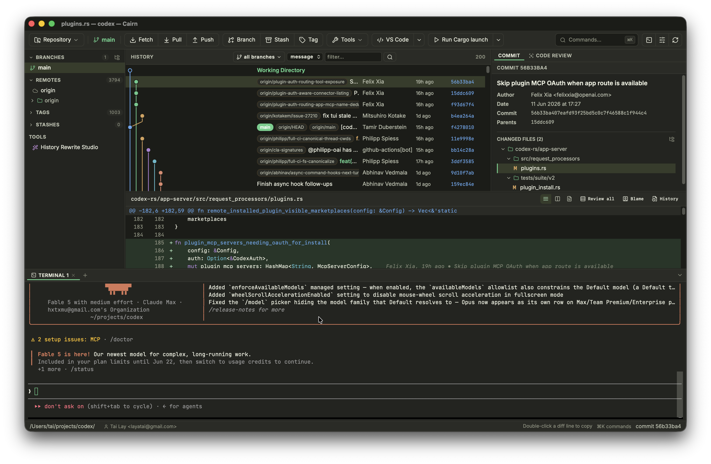
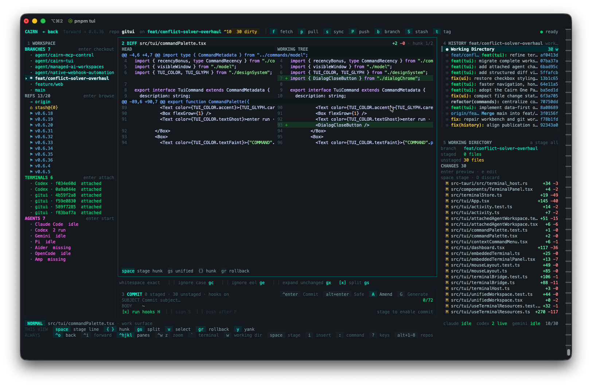
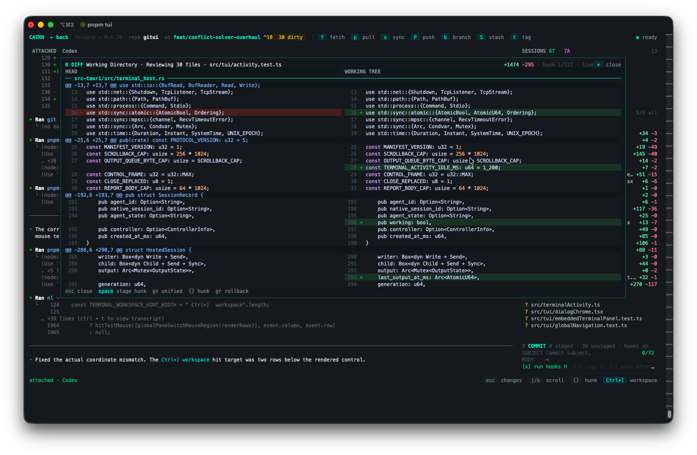
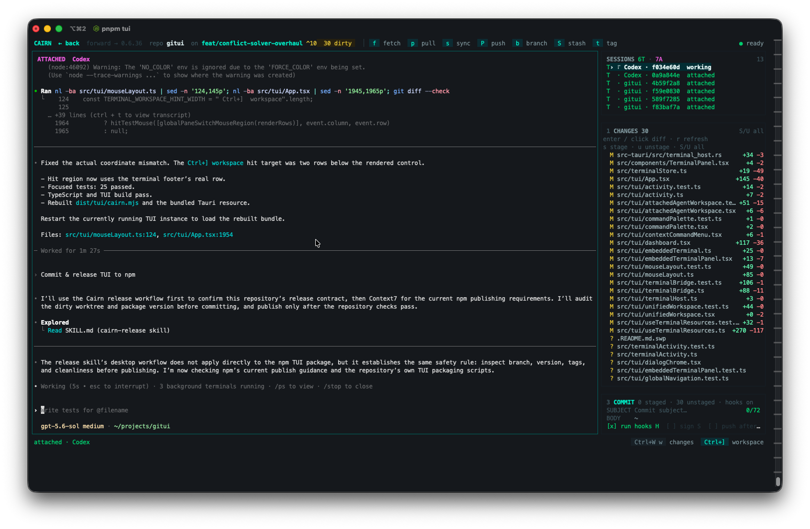

<h1 align="center">Cairn</h1>

<p align="center"><strong>A fast, cross-platform Git client with integrated terminals and AI coding-agent workflows.</strong></p>

<p align="center">
  <a href="https://github.com/layatai/cairn-app/releases/tag/v0.6.57"><strong>Download v0.6.57</strong></a>
  · <a href="https://layatai.github.io/cairn-app/">Interactive tour</a>
  · <a href="https://github.com/layatai/cairn-app/releases">All releases</a>
</p>

Cairn combines a native desktop Git client, detachable terminal sessions, and
AI coding-agent workflows. It is built with Tauri 2, Rust/libgit2, React, and
TypeScript.

This repository publishes the signed desktop installers, standalone TUI
packages, Docker image, and the [Cairn website](https://layatai.github.io/cairn-app/).

## Screenshots

### Desktop app



### Standalone TUI



| Attached diff review | Attached AI-agent session |
|---|---|
|  |  |

## Downloads

> **Recommended:** [v0.6.57](https://github.com/layatai/cairn-app/releases/tag/v0.6.57)
> is the newest release with the complete desktop and TUI asset set. v0.6.58
> contains Windows TUI recovery assets only.

| Product | Platform | Release asset | Notes |
|---|---|---|---|
| Desktop app | macOS, Intel + Apple Silicon | `Cairn_<version>_universal.dmg` | Universal, Developer ID signed, notarized, and stapled |
| Desktop app | Linux x64 + ARM64 | `.AppImage`, `.deb`, or `.rpm` | Native packages for major distributions |
| Desktop app | Windows x64 | `Cairn_<version>_x64-setup.exe` or `Cairn_<version>_x64_en-US.msi` | Windows may show SmartScreen because the installer is not yet code-signed |
| Standalone TUI | macOS | `cairn-tui-darwin-universal.tar.gz` | Universal binary |
| Standalone TUI | Linux | `cairn-tui-linux-x64.tar.gz` or `cairn-tui-linux-arm64.tar.gz` | Also supported in WSL2 |
| Standalone TUI | Windows | `cairn-tui-windows-x64.zip` or `cairn-tui-windows-arm64.zip` | Native terminal host included |

## Install the desktop app

### macOS

1. Download the universal DMG from [v0.6.57](https://github.com/layatai/cairn-app/releases/tag/v0.6.57).
2. Open it and drag **Cairn** into **Applications**.
3. Launch Cairn normally. The app is signed and notarized by Apple.

### Linux

Download the AppImage, Debian package, or RPM for your architecture from
[v0.6.57](https://github.com/layatai/cairn-app/releases/tag/v0.6.57).

### Windows

Download either the setup executable or MSI from the
[v0.6.57 release](https://github.com/layatai/cairn-app/releases/tag/v0.6.57). If
SmartScreen appears, choose **More info → Run anyway**.

## Install the standalone TUI

The standalone TUI supports macOS, Linux, Windows, and WSL2 on x64 and ARM64.
The installers select the correct architecture, install a managed Node.js
runtime and Git when needed, verify release checksums, and are safe to rerun.

### macOS, Linux, or WSL2

```bash
curl -fsSL --proto '=https' --tlsv1.2 https://layatai.github.io/cairn-app/install.sh | CAIRN_VERSION=v0.6.57 bash
```

### Windows PowerShell

```powershell
$env:CAIRN_VERSION='v0.6.57'; iwr -useb https://layatai.github.io/cairn-app/install.ps1 | iex
```

Standalone package hashes are published in
[`cairn-tui-checksums.txt`](https://github.com/layatai/cairn-app/releases/download/v0.6.57/cairn-tui-checksums.txt).
Run `cairn` inside any Git repository. `Ctrl+]` detaches from a live session;
running `cairn` again reconnects to it.

## Run Cairn with Docker

The published web image currently targets Linux AMD64. It keeps repositories
and user configuration in named volumes and binds to localhost by default. The
first start installs the common agent CLI toolset and can take one or two minutes.

```bash
CAIRN_DOCKER_PASSWORD="$(openssl rand -hex 12)"
docker run -d \
  --name cairn \
  --restart unless-stopped \
  -p 127.0.0.1:8080:8080 \
  -e CAIRN_USER=cairn \
  -e CAIRN_PASS="$CAIRN_DOCKER_PASSWORD" \
  -v cairn-workspace:/workspace \
  -v cairn-home:/home/cairn \
  docker.io/layatai/cairn-web:0.6.39
printf 'Open http://127.0.0.1:8080 and sign in as cairn with password: %s\n' "$CAIRN_DOCKER_PASSWORD"
```

Use a TLS reverse proxy before exposing Cairn beyond localhost. The immutable
`0.6.39` image and `latest` currently resolve to Docker index digest
`sha256:562ea2ca9272c0937bc303c9deb3daf5c748bf4de5c74608342d1d77ea53cd05`.

## Features

- Integrated terminal tabs for shells and AI coding agents such as Claude Code,
  Codex, Gemini, and OpenCode
- Resizable terminal session rail that automatically switches between compact
  and expanded layouts
- Standalone TUI with detachable sessions and native reconnect support
- AI-generated Conventional Commit messages from staged changes
- Commit graph with lane coloring, virtualized history, and message, author, and
  path filters
- Complete working-tree workflow: stage, unstage, discard, commit, and amend
- Branch, remote, tag, and stash management
- Fetch, pull, push, and clone through system Git authentication
- Diff viewer, blame, file history, interactive rebase, cherry-pick, revert,
  reset, merge, split, and reword
- History Rewrite Studio and stack-aware `.gitignore` generation
- Command palette, configurable themes and density, and English/Vietnamese UI

## Integrity

- The macOS v0.6.57 DMG SHA-256 is
  `96d50910db9076abbe82aab97ee64123c2fa7afbd4f8d076caf3e51ebb2c230d`.
- Standalone TUI checksums are shipped with every release and verified by the
  installation scripts.

---

© Cairn. Signed and notarized for distribution.
